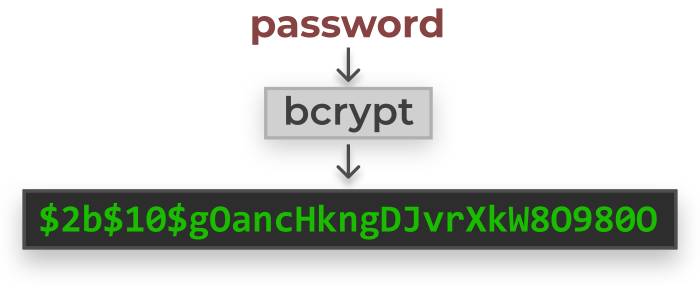
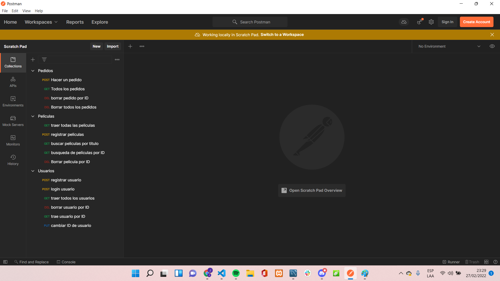
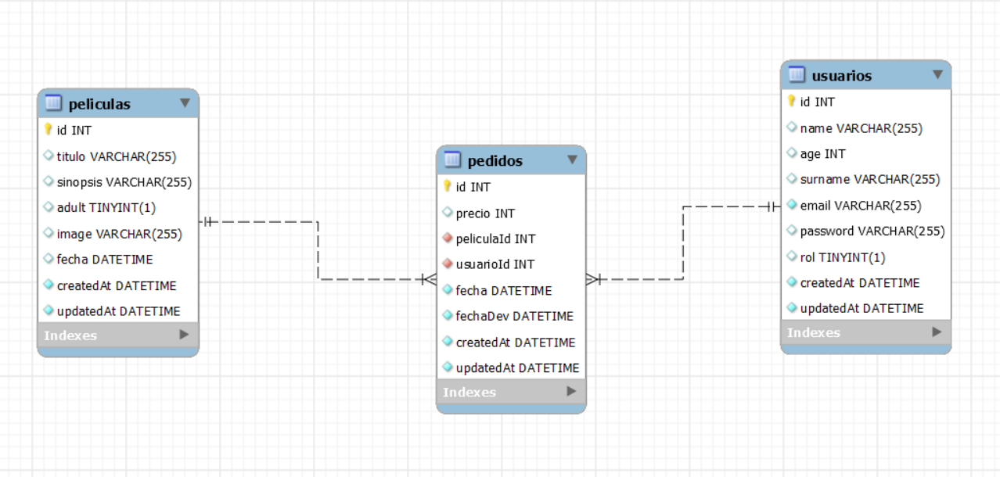

# proyecto-VideoClub

Este proyecto consiste en recrear el backend de una pagina web de alquiler de peliculas donde los usuarios podran registrarse, ver las peliculas disponibles, y hacer pedidos.
Para esto utilizamos el metodo MVC(modelo, vista y controlador), explicaremos cada uno de estos a continuacion. Para las BBDD utilizamos Sequelize( que es el ORM para Node que
nos permite ejecutar sentencias SQL a travez de MySQL Workbench.

# Instrucciones.

<ol>
  <li>Comenzamos con clonar este repositorio en tu ordenador con el comando Git clone URL </li>
   <li>npm init -y para arrancar node</li>
    <li>npm i para descargar todas las dependecias que use en este proyecto como:  
      <ul>
         <li>sequelise</li>
         <li>mysql2</li>
         <li>axios</li>
         <li>express</li>
         <li>nodemon</li>
         <li>cors</li>
         <li>jsonwebtoken</li>
         <li>bcrypt</li>
      </ul>

      
             
      
  <li> sequelize init, para arrancar a hacer peticiones SQL</li>
  <li> npm run dev, para levantar el servidor.  Las peticiones que le haras al mismo se haran a travez de Postman simulando que tenemos un frontend(futurmente lo habra)</li>
  </ol>
  
    
 # Habiendo dicho que use el patron MVC mostrare el de cada tabla usado.
 
## Estos son los endpoints de USUARIOS y sus funciones van redirigidos a la carpeta controller y su fichero propio, en este caso UsuaiosControllers donde veras sus siguientes funciones.

###  router.get('/', auth,  UsuarioController.traeUsuarios);
###  router.post('/', UsuarioController.registraUsuario);
###  router.put('/:id', auth, UsuarioController.updateProfile);
### router.delete('/:id', isAdmin, UsuarioController.deleteById);
###  router.post('/login', UsuarioController.logUsuario);

### UsuarioController.traeUsuarios = (req, res) => {}
con este llamamos a todos los usuarios
### UsuarioController.traerUsuarioId = (req, res) => {}
registramos a los nuevos usuarios
### UsuarioController.registraUsuario = async (req, res) => {}
cambiamos el Id del usuario
### UsuarioController.updateProfile = async (req, res) => {}
cambiamos el Id del usuario
### UsuarioController.deleteById = async (req, res) => {}
Borramos usuario por su ID
### UsuarioController.logUsuario = (req, res) => {}
logueamos a un usuario registrado

## Estos son los endpoints de PELICULAS y sus funciones van redirigidos a la carpeta controller y su fichero propio, en este caso UsuaiosControllers donde veras sus siguientes funciones.

### router.get('/todas', auth, PeliculasController.traePelicula);
### router.get('/:id', auth, PeliculasController.traerPeliculaId);
### router.get('/titulo/:titulo', auth, PeliculasController.traerPeliculaTitulo);
### router.post('/', PeliculasController.registraPelicula);
### router.delete('/:id', isAdmin, PeliculasController.deleteById);

### PeliculasController.traePelicula = (req,res) => {}
trae todas las peliculas
### PeliculasController.traerPeliculaId = (req, res) => {}
trae una pelicula por ID
### PeliculasController.registraPelicula = (req, res) => {}
registra una pelicula nueva
### PeliculasController.deleteById = async (req, res) => {}
elimina puna pelicula por ID
### PeliculasController.traerPeliculaTitulo = (req, res) => {}
traer pelicula por su titulo

## Estos son los endpoints de PEDIDOS y sus funciones van redirigidos a la carpeta controller y su fichero propio, en este caso PedidosControllers donde veras sus siguientes funciones.

### router.post('/', PedidosController.nuevoPedido);
### router.get('/', auth, PedidosController.todosPedidos);
### router.delete('/:id', auth, isAdmin, PedidosController.deleteById);
### router.delete('/', auth, isAdmin, PedidosController.deleteAll);

### PedidosController.nuevoPedido = (req,res) => {}
Realizamos un nuevo pedido
### PedidosController.todosPedidos = async (req,res) => {}
Llamamos a todos los pedidos
### PedidosController.deleteById = (req,res) => {}
Borramos una pelicula por ID
### PedidosController.deleteAll = (req,res) => {}
Borramos todas las peliculas

# Relacion de las tablas.
Una de las razones por las que use SQL para mi BBDD fue porque puedo hacer tablas relacionadas mientras que con otras tecnologias es mucho mas complicado. Aqui dejo una foto de mis tablas.

# Dev: Juan Pablo Parra Labarca.
# Email: parrajp1996@gail.com.

 
 

  
     
  
